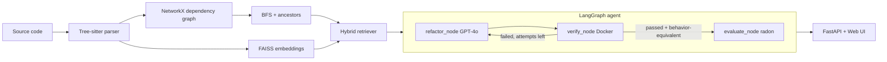

# 🕸️ Graph RAG Code Refactoring Engine

[](https://github.com/KorraSanthosh/graph-rag-code-refactoring-engine/actions/workflows/ci.yml)


An AI-powered refactoring engine that parses Python code into a dependency graph, retrieves structural **and** semantic context for the function you want to improve, and asks GPT-4o to refactor it. Every result is verified in a Docker sandbox and scored with complexity metrics. Grounding the LLM in the call graph, instead of a blind prompt, keeps refactors consistent with the rest of the codebase.

## 🏗️ Architecture



## ✨ Features

- **Graph-RAG context**: BFS over callees plus ancestor lookup on the call graph
- **Hybrid retrieval**: semantic fallback via OpenAI embeddings + FAISS when the graph has few neighbours
- **Agentic loop**: LangGraph state machine (refactor → verify → evaluate) that feeds errors back to the LLM
- **Docker sandbox**: generated code runs in throwaway containers (no network, 128 MB, 0.5 CPU, read-only FS, no capabilities, timeout)
- **Behavior check**: differential testing runs original vs. refactored function on synthesized inputs (including argument mutation) *inside the sandbox* — code that runs but changes behavior is rejected and retried
- **Quality metrics**: cyclomatic complexity, LOC and maintainability index before/after
- **Live progress**: refactor endpoint streams Server-Sent Events; the UI shows each agent step and retry
- **Interactive graph**: self-contained pyvis visualization of the dependency graph
- **Production guards**: optional access key, per-IP rate limiting, input size limits, CORS config
- **Deployable**: Dockerfile, docker-compose and an EC2 guide ([DEPLOY_AWS.md](DEPLOY_AWS.md))

## 🧰 Tech Stack

| Technology | Purpose | Why chosen |
|---|---|---|
| Tree-sitter | AST parsing | Fast, robust, error-tolerant |
| NetworkX | Dependency graph | Simple API for BFS and ancestors |
| OpenAI GPT-4o + embeddings | Refactoring and semantic search | Strong code quality |
| FAISS | Vector index | Fast local similarity search, no database |
| LangGraph | Agent state machine | Explicit, typed control flow for retries |
| Docker | Sandbox verification | Isolates untrusted generated code |
| radon | Complexity metrics | Standard CC / MI measurements |
| FastAPI | REST API | Typed schemas and auto-generated docs |
| pyvis | Graph visualization | Interactive HTML output |

## 🚀 Quick Start

**Prerequisites:** Python 3.11+, Docker (for the sandbox), an OpenAI API key.

```bash
git clone https://github.com/KorraSanthosh/graph-rag-code-refactoring-engine.git
cd graph-rag-code-refactoring-engine
pip install -r requirements.txt
cp .env.example .env        # then set OPENAI_API_KEY
uvicorn src.api.app:app --reload --port 8000
```

Open <http://localhost:8000> for the UI or <http://localhost:8000/docs> for Swagger.
The header shows `sandbox: docker` when Docker is reachable (otherwise a weaker subprocess fallback is used).

Or run everything with Docker: `docker compose up --build` (see [DEPLOY_AWS.md](DEPLOY_AWS.md) for AWS).

```bash
# Analyze
curl -X POST http://localhost:8000/api/v1/analyze \
  -H "Content-Type: application/json" \
  -d '{"source_code": "def helper(x):\n    return x * 2\n\ndef process():\n    return [helper(i) for i in range(5)]"}'

# Refactor (add -H "X-Access-Key: ..." if ACCESS_KEY is set)
curl -X POST http://localhost:8000/api/v1/refactor \
  -H "Content-Type: application/json" \
  -d '{"source_code": "def process_data():\n    data = [1,2,3,4,5]\n    result = []\n    for item in data:\n        if item > 2:\n            result.append(item * 2 + 10)\n    return result", "target_function": "process_data", "max_attempts": 3}'
```

## 📡 API Reference

| Method | Path | Description |
|---|---|---|
| GET | `/api/v1/health` | Health, Docker availability, model |
| POST | `/api/v1/analyze` | Parse code, return functions, classes, imports, graph |
| POST | `/api/v1/refactor` | Full Graph-RAG refactoring pipeline |
| POST | `/api/v1/refactor/stream` | Same pipeline, streamed as Server-Sent Events (used by the UI) |
| POST | `/api/v1/visualize` | Interactive HTML graph |
| GET | `/` | Web UI |

## 🔍 How It Works

1. **Parse** the source with Tree-sitter to extract functions, classes, imports and calls.
2. **Build** a NetworkX digraph: functions/classes are nodes, calls are edges.
3. **Retrieve structural context**: BFS (depth 2) over callees plus all ancestors of the target.
4. **Retrieve semantic context**: if the graph yields fewer than `top_k` nodes, embed the target and search FAISS for similar functions not already included.
5. **Refactor**: GPT-4o receives the code, hybrid context and current complexity.
6. **Verify**: the result runs in a Docker sandbox; crashes loop back to step 5 with the error log, up to `max_attempts`.
7. **Check behavior**: a harness executed in the same sandbox compares original vs. refactored outputs on synthesized inputs; any difference is fed back as the error.
8. **Evaluate**: radon reports complexity, LOC and maintainability before/after.

## ⚠️ Limitations

- Single-file input (no multi-file/repo analysis yet); methods are refactored but not behavior-tested.
- Equivalence testing uses synthesized inputs, so it raises confidence but is not a proof.
- Without Docker the dev fallback is *not* a security boundary — use Docker in any public deployment.

## 🧪 Running Tests

```bash
pytest tests/ -v --cov=src
```

## 📁 Project Structure

```
├── src/
│   ├── parser/         # Tree-sitter code parser
│   ├── graph/          # Dependency graph + pyvis visualizer
│   ├── retrieval/      # Hybrid (graph + FAISS) retriever
│   ├── llm/            # Prompting and GPT-4o client
│   ├── verifier/       # Docker sandbox (subprocess fallback for dev)
│   ├── evaluation/     # Complexity metrics + sandboxed equivalence checker
│   ├── agent/          # LangGraph refactor agent
│   └── api/            # FastAPI app, routes, schemas, security middleware
├── frontend/           # Vanilla JS web UI
├── tests/
├── deploy/             # EC2 user-data script
├── Dockerfile, docker-compose.yml, DEPLOY_AWS.md
└── .github/workflows/  # CI (lint, tests, Docker build)
```
